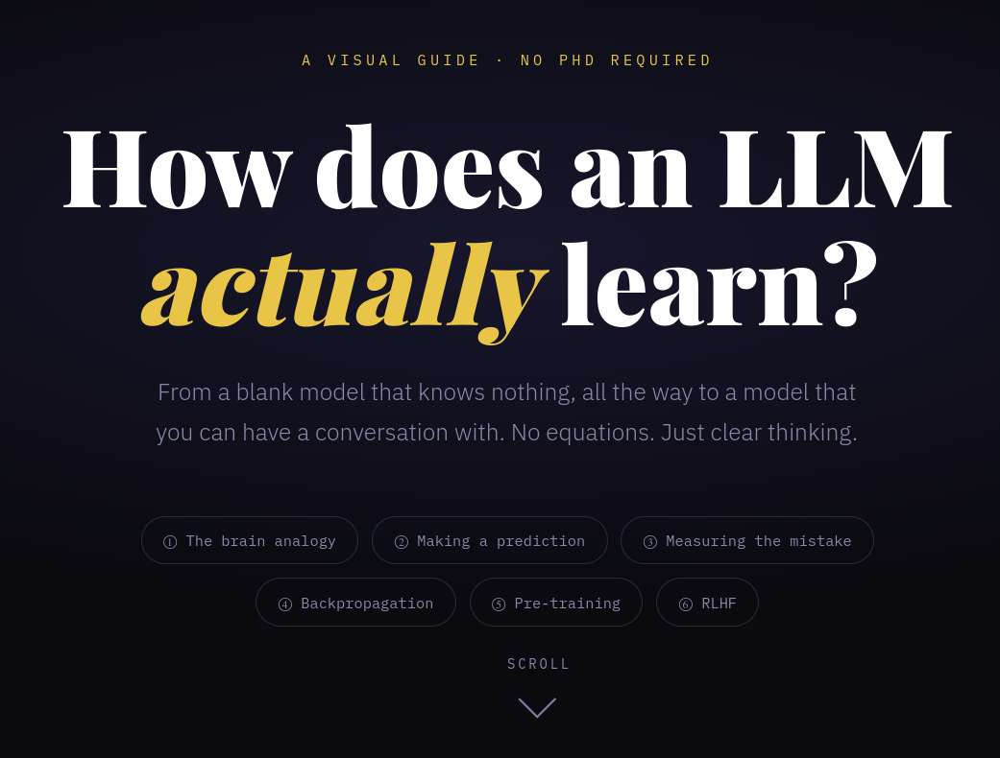
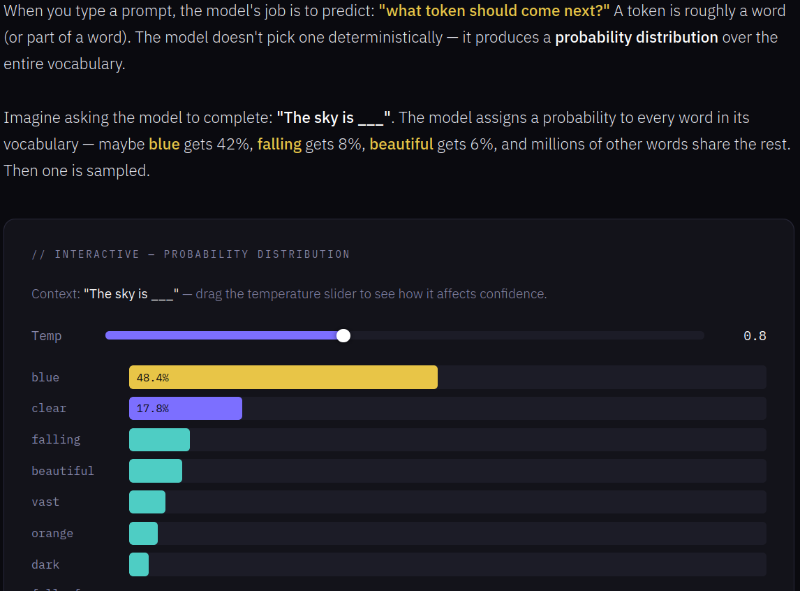
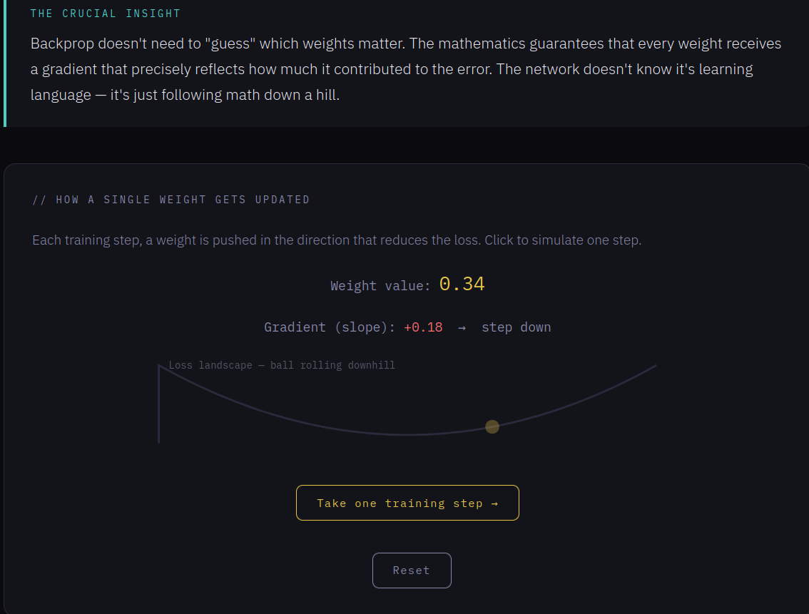
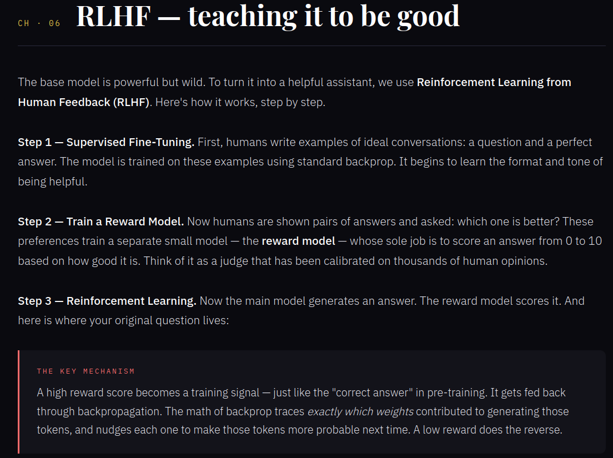

# How LLMs Learn — Interactive Visual Guide

An interactive educational microsite explaining how Large Language Models (LLMs) learn — from weights and backpropagation to pre-training and RLHF.

---

## Preview

<table>
<tr>
<td colspan="2">

</td>
</tr>

<tr>
<td>

</td>

<td>

</td>
</tr>

<tr>
<td colspan="2">

</td>
</tr>
</table>

---

## Live Demo

https://titusbru.github.io/how-llms-learn/

---

## What It Covers

* Neural network weights & layers
* Next-token prediction
* Probability distributions
* Loss functions
* Backpropagation
* Gradient descent
* Pre-training
* RLHF (Reinforcement Learning from Human Feedback)

---

## Features

* Interactive visualizations
* Animated training curves
* Temperature sampling demo
* Gradient descent simulation
* Scroll-based storytelling
* Responsive layout
* Pure client-side implementation

---

No frameworks. No dependencies.

---

## Philosophy

Most explanations of LLMs are either too mathematical or too abstract.

This project aims to explain the core ideas visually and intuitively, using interaction, animation, and metaphors instead of equation-heavy lectures.

---

## Running Locally

Clone the repository and open the project in your browser:

```bash
git clone https://github.com/TitusBru/how-llms-learn.git
cd how-llms-learn
```

Then open:

```txt
index.html
```

in your browser.

---

## License

MIT
